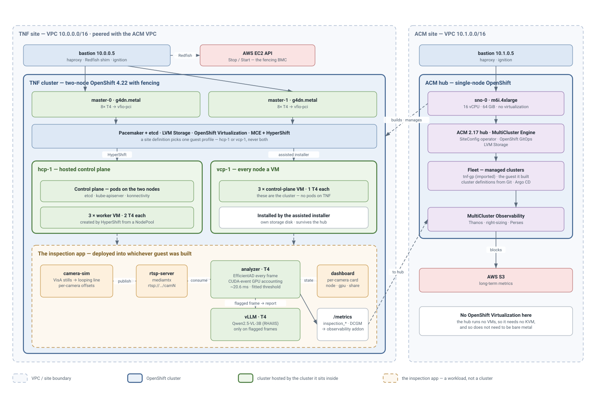

# tnf-toolbox-gp

Automation for a **Two-Node OpenShift with Fencing (TNF) 4.22 cluster on AWS
`g4dn.metal` bare metal**, which then hosts **virtualized control planes** —
guest OpenShift clusters whose worker VMs have real NVIDIA T4 GPUs passed
through to them.

Structure and conventions follow
[openshift-eng/two-node-toolbox](https://github.com/openshift-eng/two-node-toolbox);
no code is vendored from it (see [NOTICE](NOTICE)). The target is different
enough to be a separate repository: upstream runs the cluster as VMs on a
hypervisor instance, and this runs it on the metal so the GPUs are real PCI
devices on the OpenShift nodes.

## Architecture



Two peered AWS sites, and a clean split between them: **TNF runs everything,
the ACM site manages it and runs none of it.**

| | runs on | which means |
|---|---|---|
| TNF cluster | 2 × `g4dn.metal` | the two-node cluster itself, 16 × Tesla T4 between them |
| `hcp-1` control plane | **TNF**, as pods | `etcd`, `kube-apiserver`, `konnectivity` in namespace `clusters-hcp-1` |
| `hcp-1` workers | **TNF**, as KubeVirt VMs | 3 VMs in that same namespace, 2 T4 passed into each |
| the inspection app | inside `hcp-1`, on its T4s | camera-sim → analyzer → vLLM → dashboard |
| ACM hub | 1 × `m6i.4xlarge` | ACM, MCE, SiteConfig, GitOps, observability — and no workload |

TNF's own MultiCluster Engine creates the `HostedCluster`, so the control-plane
pods land beside the worker VMs they own, on the cluster that has the GPUs. The
hub's job is to manage the fleet: it imports TNF as a managed cluster, holds the
cluster definitions, and collects metrics. Nothing of the guest runs on it.

That is what lets the hub be an ordinary EC2 instance. It has no virtual
machines, so it needs no KVM, so it needs no bare metal — and a hub that lives
outside the failure domain of the cluster it manages is the reason for the
second site in the first place.

The diagram is an editable draw.io file as well as an image — open
[docs/architecture.drawio.svg](docs/architecture.drawio.svg) in
[diagrams.net](https://app.diagrams.net) or the VS Code draw.io extension. It is
generated from [hack/render-architecture.py](hack/render-architecture.py); run
`make diagram` after changing it, and `make test` checks the two agree.

## What it builds

```
ACM site  VPC 10.1.0.0/16              TNF site  VPC 10.0.0.0/16
├── bastion 10.1.0.5                   ├── bastion 10.0.0.5
│                                      │     ├── haproxy      api / api-int / *.apps
│                                      │     ├── redfish-ec2  Redfish → EC2 Stop/Start
│                                      │     └── ignition server
└── sno-0  m6i.4xlarge  10.1.0.10      ├── master-0  g4dn.metal  8× T4 → vfio-pci
      single-node OpenShift            └── master-1  g4dn.metal  8× T4 → vfio-pci
      ├── ACM + MCE                          TNF 4.22, platform:none
      ├── SiteConfig + GitOps                ├── NFD + NVIDIA GPU Operator
      └── Observability                      ├── LVM Storage on EBS gp3
                  │                          ├── OpenShift Virtualization
                  │                          ├── MCE + HyperShift
                  │                          └── clusters-hcp-1
                  │                                ├── control-plane pods
                  │                                └── 3 worker VMs, 2 T4 each
                  │                                    ▲
                  └────────── VPC peering ─────────────┘
                    management only: TNF is imported into the hub as a managed
                    cluster, so ACM sees the infrastructure and not just the
                    clusters on it
```

No nested virtualization anywhere. OpenShift Virtualization runs on the metal,
so a GPU travels exactly one hop — host PCI device → guest worker VM.

## Quick start

```bash
cp config/instance.env.template config/instance.env
$EDITOR config/instance.env
cp ~/Downloads/pull-secret.json config/           # must be config/pull-secret.json

cd deploy/
make doctor        # read-only preflight -- run this first, it is cheap
make all           # about three and a half hours, mostly waiting
```

Four things in `instance.env` need attention; the rest have working defaults:

| | |
|---|---|
| `REGION` / `AVAILABILITY_ZONE` | must agree, and `g4dn.metal` has to be offered there — `make doctor` checks both |
| `SSH_KEY_NAME` | the EC2 key pair. It does not have to exist: `make keypair` creates it, and the local key alongside it |
| `BMC_PASSWORD` | ships as `CHANGE-ME`, which `make doctor` rejects. It is the password Pacemaker fences with |
| `ALLOWED_SSH_CIDR` | ships as `0.0.0.0/0`. Narrow it to your own address |

`BASE_DOMAIN` is left blank on purpose — it is filled from the account's public
Route53 zone, so a sandbox that hands you a new domain needs no edit.

`make all` runs the stages below in order. Each is independently re-runnable and
idempotent, so a failure part-way through is resumed by re-running that stage
rather than starting over.

| Stage | What it does | Time |
|---|---|---|
| `make keypair` | create the SSH key pair from `instance.env`, or check the existing one matches | seconds |
| `make infra` | TNF site: VPC, subnet, split-horizon DNS, bastion, fencing endpoint | 2 min |
| `make acm-infra` | ACM site: its own VPC, subnet and bastion | 2 min |
| `make peering` | the VPC peering connection, and the private zones each side needs | 1 min |
| `make tnf` | install TNF 4.22 on two `g4dn.metal` **with the IOMMU enabled from first boot**, then verify it is healthy *as TNF* | 50 min |
| `make kubeconfig` | fetch every cluster's credentials and write `deploy/clusters/access.md` | seconds |
| `make iommu` | optional — checks the IOMMU and applies nothing on a cluster this repo built | seconds |
| `make gpu` | NFD + NVIDIA GPU Operator on the base cluster | 10 min |
| `make virt-mce` | LVM Storage, OpenShift Virtualization, MultiCluster Engine | 15 min |
| `make acm-site` | single-node OpenShift at the ACM site, then ACM on it, then import TNF into the hub | 56 min |
| `make guests` | guest clusters created by TNF's own MCE: control-plane pods and worker VMs both on TNF, with the GPUs | 40 min |
| `make guest-gpu` | NFD + GPU Operator inside each guest | 33 min |

Timings are measured, from a full run in `eu-west-1`. Most of `make tnf` is
`wait-for bootstrap-complete` (31 min) and `install-complete` (14 min), and most
of `make acm-site` is the same two waits for the ACM cluster.

`make tnf` and `make acm-site` build different sites and can run at the same
time if you are in a hurry; `make acm-site` waits for TNF's kubeconfig at the one
point it needs it.

`make all` runs **`make guests`**, which creates each guest through TNF's own
MultiCluster Engine: the control plane is pods on TNF and the workers are
KubeVirt VMs on TNF, so the whole guest sits on the cluster that has the GPUs.
The hub manages it and runs none of it.

Two other guest targets exist and are not in `make all`:

- **`make hcp-make-guests-from-acm`** — the same hosted topology built the other
  way round, with the control-plane pods on the ACM hub and only the worker VMs
  on TNF. It needs OpenShift Virtualization and a data volume on the hub, which
  a non-metal hub no longer has, so running it means changing
  `ACM_SNO_INSTANCE_TYPE` back to a `.metal` shape first.
- **`make vcp-make-guests-from-acm`** — a *standalone* cluster whose every node
  is a VM, control plane included. Different topology and different mechanism:
  ACM installs it with the assisted installer rather than HyperShift, so the VMs
  boot a discovery ISO and are installed the way bare metal would be.

The three are worth telling apart:

| | control plane | workers | built by |
|---|---|---|---|
| `guests` | pods on TNF | KubeVirt VMs on TNF | HyperShift, TNF's MCE |
| `hcp-make-guests-from-acm` | pods on the ACM hub | KubeVirt VMs on TNF | HyperShift, ACM's MCE |
| `vcp-make-guests-from-acm` | KubeVirt VMs on TNF | KubeVirt VMs on TNF | assisted installer |

A hosted control plane is cheaper — it is pods, and it shares the hosting
cluster's etcd machinery. A standalone one costs three more VMs before a single
workload runs, and in exchange it survives its host going away.

## Building clusters from Git

Every cluster except TNF can be described as a single `ClusterInstance` and
built by the [SiteConfig operator](https://docs.redhat.com/en/documentation/red_hat_advanced_cluster_management_for_kubernetes/2.13/html/multicluster_engine_operator_with_red_hat_advanced_cluster_management/siteconfig-intro)
from a Git repository, rather than by an Ansible role creating the install
resources directly:

```bash
make siteconfig    # SiteConfig operator + the install templates + OpenShift GitOps
make sites         # one folder per cluster, written under sites/ and sites-infra/
git add sites sites-infra && git commit -m "the fleet" && git push
```

Ansible generates; Git is what the hub reconciles against. An ApplicationSet
turns each folder into an Argo CD Application, so adding a cluster is a commit
and a `ClusterInstance` edited by hand on the hub is put back.

**Secrets never go to Git.** Each site's pull secret — and for a hosted cluster
the infra-cluster kubeconfig and its etcd encryption key — are written straight
to the hub by `make sites`. Nor does the discovery ISO's URL: it carries a
signed token that does not expire, and the image it fetches contains the
cluster's pull secret and SSH key, so in a public repository it would be a
permanent credential to both.

`make sites` is re-runnable and is meant to be re-run. A cluster that does not
exist yet has no kubeconfig to harvest, no agents to approve and no InfraEnv to
import an ISO from, so the stage does what it can and says what it skipped.
Running it again once Argo CD has caught up picks up the rest.

### Two directories, because the pieces live on two clusters

An Argo CD Application has exactly one destination, and a guest's pieces do not
all belong in one place:

| | Synced to | Holds |
|---|---|---|
| `sites/<cluster>/` | the ACM hub | the namespace and the `ClusterInstance` |
| `sites-infra/<cluster>/` | the infra cluster (TNF) | the `VirtualMachine`s an all-VM cluster's nodes run on |

Argo CD reaches the infra cluster through ACM's own integration — a `Placement`
selects it and a `GitOpsCluster` hands it over, so ACM owns and rotates the
cluster secret rather than a kubeconfig being minted into one by hand.

A hosted cluster has no folder under `sites-infra/`: HyperShift creates its
worker VMs itself from the NodePool's replica count.

### What is the *what* and what is the *how*

A site definition carries identity and networking. Everything about how the
cluster is installed lives in the template it points at, which is created by the
role that owns that profile:

| Profile | Template | Renders |
|---|---|---|
| whole cluster on VMs | `vcp-cluster-templates-v1` | ClusterDeployment, AgentClusterInstall, InfraEnv, ManagedCluster, KlusterletAddonConfig |
| hosted control plane | `hcp-kubevirt-cluster-templates-v1` | HostedCluster, NodePool, ManagedCluster, KlusterletAddonConfig |

Neither is the set that ships with the operator, for reasons written into the
top of each template file. The shipped `ai-*` set renders one InfraEnv *per
node*, named after that node — the bare-metal model, where one discovery ISO is
bound to one `BareMetalHost`. Our nodes are KubeVirt VMs sharing one ISO. The
shipped hosted set renders `platform: type: Agent` with one `NodePool` of
`replicas: 1` per node; ours are OpenShift Virtualization VMs that HyperShift
creates itself from a replica count.

### Four things worth knowing before you use it

**`spec.nodes` runs opposite ways for the two profiles**, and the CRD will not
tell you. It accepts an empty list either way; the operator then rejects it at
reconcile, so the Argo CD Application syncs green and no cluster appears:

```
controlPlaneCount < 1 && clusterType != HostedControlPlane
  -> "at least 1 control-plane agent is required"
controlPlaneCount > 0 && clusterType == HostedControlPlane
  -> "hosted control plane clusters must not have control-plane agents"
```

So an all-VM cluster lists every node and a hosted one lists none. Three of each
listed node's required fields are fictions — a `NodeSpec` describes hardware to
be *claimed*, and these VMs do not exist until the infra cluster creates them —
so `bmcAddress` points into TEST-NET-1, the boot MAC is locally administered,
and the credentials `Secret` exists only because the validator checks that it
does. Nothing reads them: the node template set renders no `BareMetalHost`.

**A site definition committed wrong cannot be fixed by committing it right.** A
`ClusterInstance` spec is immutable once created, so Argo CD retries forever and
reports `OutOfSync` at the correct revision:

```
admission webhook denied the request:
spec update not allowed during provisioning or cluster reinstalls
```

The object has to be deleted so Argo CD recreates it. Deleting a
`ClusterInstance` normally deprovisions its cluster, so check what it has
actually rendered first — one that failed validation has rendered nothing and
can be deleted freely.

**Sizing and counts live in the template, not the site definition.** The
`ClusterInstance` API has nowhere to put cores, memory or GPUs. This matches how
the toolbox already works: `GUEST_VM_CORES` and friends in `config/instance.env`
are fleet-wide rather than per guest. A differently shaped cluster is a second
template set, which is the separation the operator is built around.

**`oc get application` answers about the wrong thing on the hub.** ACM ships
`applications.app.k8s.io` and it shadows Argo CD's, so a bare `oc get
application` reports "No resources found" while the Applications exist. Ask for
`oc get applications.argoproj.io -n openshift-gitops`.

One thing the conversion fixes outright: `hcp create` mints a fresh random
`infraID` on every invocation, and `infraID` is immutable once the
`HostedCluster` exists, so re-rendering a guest could never be applied. A
template sets `infraID` from the cluster name, so rendering is repeatable.

### Why TNF is not in this

TNF is installed by `openshift-baremetal-install` onto EC2 metal. The assisted
installer cannot reach that hardware: provisioning a `BareMetalHost` needs
Ironic to attach a discovery ISO over Redfish virtual media, EC2 has no virtual
media to attach, and the Redfish shim on the bastion implements `Systems`,
`PowerState` and `ComputerSystem.Reset` only. TNF is also the infra cluster
every one of these guests runs on, and the hub's own SNO cannot provision
itself, so both stay on their current installers.

## The application

[`app/`](app/) is what the stack is for: a GPU visual inspection pipeline that
scores every frame of simulated production-line cameras on one T4 and asks a
vision-language model on a second what is wrong with the frames it flags.
[`app/README.md`](app/README.md) covers the design and the T4 constraints that
shaped it.

```bash
cd deploy/ && make app
```

Not in `make all`, because it is the payload rather than the platform. It goes
into every guest cluster, which is the only place it can run: TNF's own T4s are
bound to `vfio-pci` for passthrough and advertise no `nvidia.com/gpu` at all, so
its pods would sit Pending there. Inside a guest the passed-through T4 is an
ordinary PCI device, which is what `make guest-gpu` arranges -- so run that
first. The images are built by the guest cluster itself from `app/`, straight
into its own internal registry.

**One instance takes two GPUs** — one for the analyzer's fast path, one for
vLLM. `APP_INSTANCES` in `config/instance.env` runs more than one copy per
guest, each a complete pipeline in its own namespace with its own cameras,
analyzer, vLLM and dashboard, so two are two independent production lines rather
than one line scaled up. A guest with three workers at two T4s each has room for
three. The images are built once by the first instance and shared; the rest are
granted `system:image-puller` on its namespace rather than rebuilding a
byte-identical 6.6GiB analyzer layer.

**`make iommu` reboots nothing now, but it is not optional.** `make tnf` writes
the IOMMU MachineConfig into the install manifests, so both nodes boot with
`intel_iommu=on iommu=pt` and there is no rollout to survive. On a cluster built
by this repo the stage finds the arguments already in place and applies nothing:

```
$ make iommu
intel_iommu=on iommu=pt already on every node and
100-master-gpu-passthrough is in place. Nothing to apply, and no reboot.
```

It still has to run, because it is also the only thing that labels the nodes
`nvidia.com/gpu.workload.config=vm-passthrough`. Without that label the GPU
Operator leaves them on `sandboxWorkloads.defaultWorkload` — container mode —
the T4s stay bound to the NVIDIA driver instead of `vfio-pci`, no passthrough
resource is ever advertised, and `make virt-mce` fails minutes later at
`discover-gpu-resource` with an error that points at GPUs rather than at a
missing label. `make all` includes it; skipping stages by hand is where this
bites.

It also still performs the day-2 rollout on a cluster built before the
MachineConfig moved into the install manifests. Which is worth avoiding: adding those arguments to a *running* two-node
cluster reboots each node in turn, and a node that comes back is not reliably
re-added to the Pacemaker pair. The survivor rewrites corosync to a single-node
cluster to keep quorum — designed behaviour — and does not always undo it. The
returning node has no quorum, Pacemaker starts nothing on it, and neither side
can re-form the pair. That cost three clusters here before the arguments moved
to day 1; [docs/deploy-log.md](docs/deploy-log.md) defect 20 has the anatomy and
`make tnf-recover` is what to run when it happens.

**The rest of the ordering is still deliberate.** Credentials are fetched before
anything risky, and the stages that reboot or reconfigure re-check TNF health
afterwards, because a cluster that cannot re-form a Pacemaker pair is a failure
of *that* stage, not a mysterious GPU problem two stages later.

## When the cluster does not come back

A MachineConfig rollout reboots the two nodes one at a time, and the pair does
not always re-form. The surviving node rewrites corosync to a single-node
cluster to keep quorum — that part is designed — and does not always re-add the
peer when it returns. The node that comes back then has no quorum, Pacemaker
starts nothing on it, and its kubelet never reports. It has happened three times
here; `docs/deploy-log.md` defect 20 has the anatomy.

```bash
cd deploy/ && make tnf-recover
```

This works through the procedure in the OpenShift documentation — *Two-node
with Fencing → Post-installation troubleshooting and recovery → Manually
recovering from a disruption event when automated recovery is unavailable* — in
the order it gives, least invasive first, re-checking the cluster after each
step and stopping at the first one that fixes it:

| | step | runs when |
|---|---|---|
| 1 | `pcs resource cleanup` | always |
| 2 | `pcs resource cleanup etcd` | always |
| 3 | `pcs quorum unblock` | the peer is genuinely unreachable |
| 4 | `pcs stonith confirm <node>` | opt-in **and** the peer is unreachable |
| 5 | restore etcd from `/var/lib/etcd-backup` | opt-in |

Steps 3 and 4 are gated on the missing node actually being gone, which the role
checks by pinging it from the survivor rather than taking the cluster's word for
it. The documentation is blunt about why: confirming a fence for a node that is
in fact running leaves both halves believing they own etcd, which loses data
rather than time. Steps 4 and 5 need saying so as well:

```bash
make tnf-recover EXTRA_ARGS='-e tnf_recover_allow_fence_confirm=true'
make tnf-recover EXTRA_ARGS='-e tnf_recover_allow_etcd_restore=true'
```

It runs from whichever node is still `Ready`, not from a fixed one — the node
that is down is as likely to be the first as the second, and `oc debug` against
a `NotReady` node hangs for minutes before failing.

It gathers nothing for a support bundle — only what a step needs in order to
decide. The expensive probe (Pacemaker, via `oc debug`, about a minute) is
skipped whenever a one-call check has already shown the cluster is unwell, which
matters because the checks run after every step.

If every step leaves it broken the run fails, prints the state, and names the
commands to look further with. Two things it will not do unattended: replace a
node, and
restore the surviving node's saved `/etc/corosync/corosync.conf.<timestamp>`
over its single-node one. The second is the repair when the two nodes simply
disagree about membership and neither is down — which is not a case the
documented ladder covers.

## Credentials

`make kubeconfig` collects every cluster's credentials onto your workstation and
writes **`deploy/clusters/access.md`** -- one page listing, for each cluster, the
console URL, the API URL, the login, and the absolute path to its kubeconfig:

```
deploy/clusters/
├── access.md                     <- start here
├── tnf-gp/{kubeconfig,kubeadmin-password}
└── acm/{kubeconfig,kubeadmin-password}
    ├── hcp-1.kubeconfig, hcp-1-kubeadmin-password
    └── hcp-2.kubeconfig, hcp-2-kubeadmin-password
```

Guest credentials live under the hub that created them, because that is where
they come from: a guest cluster has no `auth/` directory, and HyperShift keeps
its kubeadmin password in a secret on the hub.

It is safe to re-run at any point, and skips any site whose cluster does not
answer -- so running it early, before the ACM site exists, collects TNF alone and
says so. The whole directory is gitignored; the page holds kubeadmin passwords in
plain text and is written `0600`.

Guest cluster consoles resolve publicly, on the infra cluster's apps wildcard one
level down (`...apps.<guest>.apps.<base cluster domain>`). Their APIs do not: they
are NodePorts on the hosting cluster's private address — TNF's `master-0`, since
TNF hosts them — reachable from the bastions.

`make status` summarises stacks, instance power state, bastion services and
cluster health at any point. `make destroy` removes everything.

The cluster is **publicly resolvable**. `BASE_DOMAIN` is left empty and the
toolbox discovers the account's public Route53 zone, putting the cluster at
`<cluster>.<that zone>` — so the fetched kubeconfig works from anywhere with no
`/etc/hosts` entries and no `--insecure-skip-tls-verify`, because the installer
issues the API certificate for exactly that name. Cluster nodes still resolve
the same names privately inside the VPC. `ALLOWED_API_CIDR` governs who can
reach the API and ingress and defaults to open; `ALLOWED_SSH_CIDR` is separate
and should stay narrow.

## The three decisions that shape this repo

### Fencing has to be invented, because EC2 has no BMC

TNF needs Pacemaker to be able to kill a misbehaving peer. The only stonith
agent OpenShift wires up is `fence_redfish` — `cluster-etcd-operator`'s
`pkg/tnf/pkg/pcs/fencing.go` hardcodes `FencingDeviceType: "fence_redfish"`, and
there is no code path that creates any other agent. (`fence_aws` appears in that
operator only in the status collector, as a resource type it will display if you
built one by hand.)

EC2 bare metal instances have no BMC and no Redfish service. So
[`tools/redfish-ec2/`](tools/redfish-ec2/) is a small Redfish endpoint that
serves the slice of the schema `fence_redfish` actually uses and turns resets
into `StopInstances` / `StartInstances`. It runs on the bastion, and the
fencing addresses in `install-config.yaml` point at it.

Consequence worth knowing before you measure anything: **a fence takes 5–15
minutes here**, because stopping a bare metal instance takes minutes where a BMC
cuts power in seconds. The playbooks raise Pacemaker's timeouts to match.
Details in [docs/fencing-on-aws.md](docs/fencing-on-aws.md).

### GPUs are assigned per node, not per GPU

The NVIDIA GPU Operator assigns a whole node to one mode: its GPUs are bound
either to the NVIDIA driver (containers) or to `vfio-pci` (VM passthrough).
There is no way to split a single node between the two — the operator's driver
container unbinds `vfio-pci` from every device on a node it manages, so a
per-GPU split is undone minutes after it is made. That was measured here, not
assumed; defect 37 in [docs/deploy-log.md](docs/deploy-log.md) has the evidence.

Both nodes default to `vm-passthrough`, so all sixteen T4s go to virtual
machines and a guest cluster's workers spread across both machines instead of
piling onto whichever node held the GPUs. The cost is that no pod on the base
cluster can request a GPU. Set `MASTER0_GPU_WORKLOAD=container` in
`config/instance.env` for one node each way instead.
[docs/gpu-allocation.md](docs/gpu-allocation.md) covers the trade-off.

### Storage is pinned to EBS, deliberately

`g4dn.metal` ships two 900 GiB instance-store NVMe drives, and LVM Storage would
happily claim them if left to discover its own disks. Instance store does not
survive a stop/start — and **fencing is a stop/start**. The guest clusters'
hosted control-plane etcd lives on this storage, so the `lvm-storage` role pins
the volume group to the EBS data volume by its volume id and never touches the
instance store.

## Cost

Bare metal is the entire bill for practical purposes:

| | |
|---|---|
| 2 x `g4dn.metal` (TNF) | ~$15.70/hour |
| 1 x `m6i.4xlarge` (ACM site) | ~$0.77/hour |
| 2 x `m5.large` bastions | ~$0.20/hour |

Roughly **$17/hour on demand** before storage and transfer, for both sites.

The hub was a `m5zn.metal` at about $4.00/hour while it ran OpenShift
Virtualization. The guest control planes and their worker VMs moved to TNF,
which left the hub with no virtual machines and so no need for KVM; an ordinary
instance is about a fifth of the price. Putting virtualization back on the hub
means putting metal back with it.

`make destroy` removes the TNF site and `make destroy-acm` the ACM one — run
both. `make clean` keeps the network and bastion, and therefore the fencing
address, while removing the expensive part.

The G/VT vCPU quota needs to be at least 192 for the two `g4dn.metal`.
`make doctor` checks that, along with whether the instance types are offered in
your AZ at all.

## Repository layout

```
app/                     the visual inspection app: camera-sim, analyzer,
                         dashboard, manifests, and the curated VisA frames
config/                  instance.env + pull secret (both gitignored)
deploy/
  aws-infra/             CloudFormation and the stack lifecycle scripts
    templates/           network / services / compute / bootstrap / peering /
                         sno-compute stacks, for both sites
    scripts/             create, destroy, doctor, status, inventory, ssh
  openshift-clusters/    Ansible: the numbered stages, plus teardown
    roles/               one role per layer, reused across sites and guests
sites/                   generated: one ClusterInstance per cluster, synced to
                         the hub by Argo CD (commit these)
sites-infra/             generated: the VirtualMachines an all-VM cluster's
                         nodes run on, synced to TNF (commit these too)
docs/                    architecture, fencing, GPU allocation, guest clusters,
                         the app redesign, and the editable diagram
hack/                    lint, static template checks, and the diagram renderer
tools/redfish-ec2/       the Redfish → EC2 fencing shim, with unit tests
```

Ansible targets exactly one host, the bastion. It is inside the VPC and so the
only host that can resolve `api-int` through the private hosted zone, which
means it is the only host that can drive an install.

## Current status

Built and running against real hardware. What exists today, and what is known
to be unfinished:

| | State |
|---|---|
| TNF two-node cluster, fencing, GPU passthrough | working |
| ACM hub (2.17) on its own site, TNF imported | working |
| Guest cluster `hcp-1` — hosted control plane, 3 worker VMs, 2 T4 each | working, **but hosted on the hub**; see below |
| Visual inspection app — real VisA imagery, EfficientAD, per-camera GPU accounting | **working, mis-calibrated** |
| MultiCluster Observability, right-sizing, Perses, custom dashboard | **written, not deployed** |

**The guest has not yet been built on TNF.** Every run so far created `hcp-1`
from the hub, with its control-plane pods on the ACM node. `make all` now runs
`make guests` instead, which creates it through TNF's own MultiCluster Engine so
the pods land beside the worker VMs — the architecture described at the top of
this file. The playbook behind it has existed all along but has never completed
a run, so treat the topology as intended rather than proven until a full
`make all` has been through it.

**The app runs and the GPU is genuinely loaded** — four cameras at ~20.6 ms a
frame, each holding roughly a quarter of one T4, the device at ~75-88%. That is
the throughput the detector was chosen for, and it also says four cameras is
about the ceiling for one analyzer on one card.

**Its verdicts are not yet trustworthy.** Every camera currently reads FAIL,
scoring 0.37-0.46 against a threshold fitted at 0.28. The detector is
under-fitted rather than the parts being defective, so the threshold derived
from its own view of "normal" sits below where normal actually lands. The
plan and the open questions are in
[docs/visual-inspection-redesign.md](docs/visual-inspection-redesign.md).

**Observability is written but has never run.** `make observability-bucket`
plus the `observability` role add MultiCluster Observability on S3, both
right-sizing capabilities, the Perses UI and a GPU/application dashboard. Two
things are known to be missing before the dashboard can have data: the guest
cluster has no user-workload monitoring and no `ServiceMonitor`, so nothing
scrapes the analyzer yet.

Two deliberate departures from the documented path, both recorded where the
code is: the hub backs Thanos with **real AWS S3** rather than ODF/Noobaa
(there is no ODF on a single-node hub already carrying ACM and MCE), and
it uses a **local-volume storage class** for Thanos' own PVCs, which the ACM
docs advise against — on a single node there is nowhere else to reschedule to.

## What is verified, and what is not

`make test` runs without AWS, a cluster, or credentials:

- **19 unit tests** for the Redfish shim — routing, both auth modes, the
  power-state mapping including every transitional EC2 state, and reset-type
  translation. The EC2 layer is stubbed.
- **237 static checks** over the templates — every Jinja template renders under
  `StrictUndefined`, the rendered `install-config.yaml` has the fencing shape
  TNF requires, the ignition pointers are valid JSON inside the CloudFormation
  parameter limit, haproxy drops bootstrap from the ingress backends, every
  CloudFormation `Ref`/`GetAtt` resolves to something declared, and each
  `ClusterInstance` names an install template that some role actually creates.
- **Playbook syntax checks** for all fifteen playbooks.

**This has been run end to end against real hardware in AWS**, and the whole
pipeline completes: both sites, GPUs reaching guest cluster workers, and
`nvidia.com/gpu` schedulable inside the guests.

Getting there found **37 defects** that no amount of static checking would have
caught — a CLI that cannot encode an ignition config as a parameter, a device
name already claimed by instance store, an Ansible precedence rule that silently
discards a role parameter sharing a name with an extra var, an ingress setting on
one cluster that stops a GPU operator two clusters away. Each one, its symptom
and its fix is written up in [docs/deploy-log.md](docs/deploy-log.md), which is
worth reading before a first run.

Guest cluster ingress **works**, and was the last thing to. The KubeVirt
provider expects a `LoadBalancer` for it, and there is no provisioner for one
here: both clusters run without a cloud provider. MetalLB is not the way out —
[its own documentation](https://metallb.universe.tf/installation/clouds/) lists
AWS as unsupported, because a cloud fabric resolves only addresses the platform
has assigned to an ENI, so L2's ARP announcements reach nothing. So the guest's
control-plane services are published on `NodePort` instead, and its `*.apps` wildcard is served by a passthrough route on
the infra cluster. That route has to be *admitted*, which needs
`wildcardPolicy: WildcardsAllowed` on the infra cluster's IngressController;
without it the guest console never comes up, its ClusterVersion never completes,
and the NVIDIA GPU Operator inside the guest refuses to start. See
[docs/hcp-guests.md](docs/hcp-guests.md).

That leaves one thing broken from outside the VPC. The console *page* is served
through the passthrough route and loads, but it immediately redirects to the
OAuth server to log in — and OAuth is a NodePort on a private address inside the
VPC, so the redirect names something a browser cannot reach. `make guest-lb
GUEST=<name>` builds an AWS network load balancer in front of the API and OAuth
NodePorts, and `GUEST_PUBLIC_CONTROL_PLANE=true` publishes the guest against it,
which is what MetalLB's documentation means by "use the platform's load
balancer".

Only the two services a human touches move there. Ignition and Konnectivity stay
on `master0_private_ip`, because those are spoken only by the worker VMs, which
now run on TNF alongside the control plane that serves them — the same cluster,
the same subnet, no peering in the path at all. Hosting the control plane on the
hub is what used to make this delicate: the API server had to be reachable both
by a browser outside the VPC and by worker VMs at the other site, and publishing
it sent their traffic out through the internet gateway and back. With both ends
on TNF that tension is gone.

Set it in `config/instance.env`. Until recently the Makefile documented the
variable and the playbook wrapper never passed it, so setting it did nothing at
all and the guest came up private whatever the config said.

Still **written but not run end to end**. The pieces are verified — the load
balancer builds, the wrapper carries the setting, and the install template
publishes API and OAuth on the balancer's name with the pinned ports while the
other two stay private — but the environment was shut down before a guest was
rebuilt against it, so the login it exists to fix has not been seen to work.
Note also that `spec.services` is immutable once a `HostedCluster` exists, so
switching an existing guest means deleting its `ClusterInstance` and letting
Argo CD rebuild it.

## Documentation

- [docs/architecture.md](docs/architecture.md) — how the pieces fit, and why
  `platform: none`
- [docs/fencing-on-aws.md](docs/fencing-on-aws.md) — the shim, timeouts, and
  how to test a fence. `make tnf-recover` is what to run when a fence or a
  reboot leaves the pair unable to re-form
- [docs/gpu-allocation.md](docs/gpu-allocation.md) — why the split is per node,
  what both-nodes-passthrough costs, and how to change it
- [docs/hcp-guests.md](docs/hcp-guests.md) — guest clusters, GPU passthrough,
  and how their ingress is published
- [tools/redfish-ec2/README.md](tools/redfish-ec2/README.md) — the shim in
  detail
- [docs/deploy-log.md](docs/deploy-log.md) — what actually broke on real
  hardware, and what fixed it
- [docs/visual-inspection-redesign.md](docs/visual-inspection-redesign.md) —
  the app's design: VisA imagery, EfficientAD, per-camera GPU accounting, and
  the open questions
- [docs/architecture.drawio.svg](docs/architecture.drawio.svg) — the diagram
  above, editable in draw.io
